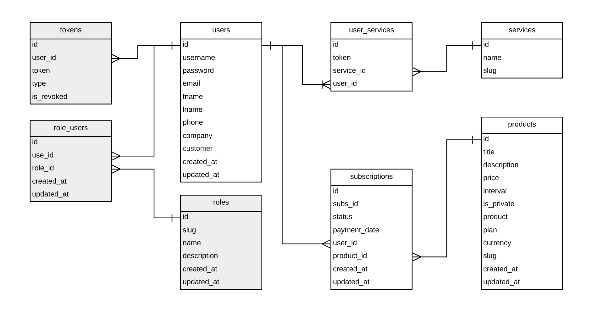

# BrightestMinds Dashboard API
Implementing a backend using AdonisJS for the BrightestMinds client dashboard application


## Setup
At the beginning of the configuration of the project you need to have to install:

###### PostgreSQL database
> Windows / Linux - https://www.postgresql.org/download/

> MacOS - https://postgresapp.com/

###### Generate the secret key
```bash
adonis key:generate
```


#### .Env
Copy the .env.example file and rename it to .env. Then insert the missing data.


#### Migrations
Run the following command to run startup migrations.
```bash
adonis migration:run
```


#### Seeds
Run the following command to create test data.
```bash
adonis seed
```


## Commands

#### Dev
This command is a utility that will monitor for any changes in your source and automatically restart the server.
```bash
npm run dev
```

#### Start
This command starts the server.
```bash
npm run start
```

#### Lint
Check code for errors.
```bash
npm run lint
```

#### Delete local test data from Stripe 
Delete local test data from Stripe  _(products, plans, customers, subscriptions)_. You need to enter **Admin credentials**.
```bash
adonis clean:local
```


## DB Structure

